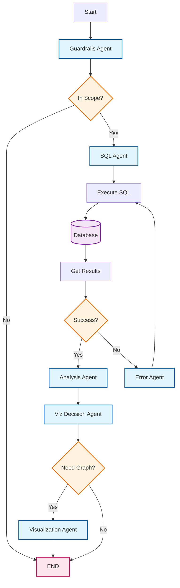

# Building an Intelligent Text-to-SQL Multi-Agent Chatbot with LangGraph and Chainlit


> *Transforming Natural Language Questions into Actionable Database Insights Using Multi-Agent Architecture*

---

Read the full medium article here: [Agentic AI Project: Build Multi-Agent Text2SQL Chatbot for Ecommerce Database
](https://medium.com/towards-artificial-intelligence/agentic-ai-project-build-multi-agent-text2sql-chatbot-for-ecommerce-database-c8d0e294ec94)


https://github.com/user-attachments/assets/4e1988b2-b131-4421-bbd4-38eaecaaae38


## 📚 Table of Contents

- [Introduction](#-introduction)
- [Problem Statement](#-problem-statement)
- [Tech Stack](#-tech-stack)
- [System Architecture](#-system-architecture)
- [Core Components](#-core-components)
- [Key Features](#-key-features)
- [Installation & Setup](#-installation--setup)
- [Usage](#-usage)
- [Workflow Visualization](#-workflow-visualization)
- [Limitations](#-limitations)
- [Future Enhancements](#-future-enhancements)
- [Conclusion](#-conclusion)
- [Contributing](#-contributing)
- [License](#-license)

---

## 🎯 Introduction

In the era of data-driven decision making, **accessing and understanding business data shouldn't require SQL expertise**. This project presents an intelligent **Multi-Agent Text-to-SQL Chatbot** that democratizes data access by converting natural language questions into SQL queries, executing them, and presenting results with intelligent visualizations.

Built using **LangGraph's state machine architecture** and powered by **OpenAI's GPT-4**, this system orchestrates multiple specialized AI agents that work together to provide accurate, context-aware responses to e-commerce database queries.

### What Makes This Special?

- **Multi-Agent Orchestration**: Five specialized agents working in harmony
- **Intelligent Guardrails**: Scope validation and greeting detection
- **Auto-Visualization**: Smart decision-making for graph generation
- **Error Recovery**: Self-healing SQL queries with retry logic
- **Real-time Streaming**: Live workflow visualization in the UI
- **Interactive UI**: Beautiful Chainlit interface with expandable steps

---

## 🔴 Problem Statement

### The Challenge

Organizations maintain vast amounts of data in relational databases, but accessing this data presents several challenges:

1. **Technical Barrier**: Non-technical stakeholders cannot query databases directly
2. **SQL Complexity**: Writing complex JOINs and aggregations requires expertise
3. **Time Consumption**: Back-and-forth with data teams slows decision-making
4. **Visualization Gap**: Raw query results don't provide immediate insights
5. **Error Prone**: Manual SQL queries are susceptible to syntax and logical errors

### The Solution

A conversational AI system that:
- ✅ Accepts natural language questions in plain English
- ✅ Validates scope to prevent irrelevant queries
- ✅ Generates optimized SQL queries automatically
- ✅ Handles errors intelligently with retry mechanisms
- ✅ Provides natural language explanations of results
- ✅ Creates visualizations when beneficial
- ✅ Streams execution process for transparency

---

## 🛠️ Tech Stack

### Core Framework
- **[LangGraph 1.0.3](https://github.com/langchain-ai/langgraph)** - State machine orchestration for agentic workflows
- **[Chainlit 2.9.0](https://github.com/Chainlit/chainlit)** - Interactive chat UI with streaming support

### AI & LLM
- **[OpenAI API](https://openai.com/)** - GPT-4o-mini for agent intelligence
- **Function Calling** - Structured JSON outputs for agent coordination

### Data & Database
- **[SQLite3](https://www.sqlite.org/)** - Lightweight, serverless database
- **[Pandas 2.3.3](https://pandas.pydata.org/)** - Data manipulation and CSV loading
- **Brazilian E-commerce Dataset** - Real-world Olist data (2016-2018)

### Visualization
- **[Plotly 6.4.0](https://plotly.com/)** - Interactive JavaScript-based charts
- **LLM-Generated Viz Code** - Dynamic Plotly code generation

### Utilities
- **[python-dotenv 1.2.1](https://github.com/theskumar/python-dotenv)** - Environment variable management

---

## 🏗️ System Architecture

### High-Level Architecture

```
┌─────────────────────────────────────────────────────────────────┐
│                         User Interface                          │
│                      (Chainlit Frontend)                        │
└────────────────────────────┬────────────────────────────────────┘
                             │
                             ▼
┌─────────────────────────────────────────────────────────────────┐
│                    LangGraph State Machine                      │
│                                                                 │
│  ┌──────────────┐    ┌──────────────┐    ┌──────────────┐    │
│  │ Guardrails   │───▶│  SQL Agent   │───▶│ Execute SQL  │    │
│  │    Agent     │    │              │    │              │    │
│  └──────────────┘    └──────────────┘    └──────┬───────┘    │
│                                                   │            │
│                      ┌────────────────────────────┘            │
│                      ▼                                         │
│  ┌──────────────┐    ┌──────────────┐    ┌──────────────┐    │
│  │ Error Agent  │◀───│  Analysis    │───▶│ Decide Graph │    │
│  │  (Retry)     │    │    Agent     │    │     Need     │    │
│  └──────────────┘    └──────────────┘    └──────┬───────┘    │
│                                                   │            │
│                                                   ▼            │
│                                          ┌──────────────┐      │
│                                          │ Viz Agent    │      │
│                                          │ (Plotly)     │      │
│                                          └──────────────┘      │
└─────────────────────────────────────────────────────────────────┘
                             │
                             ▼
┌─────────────────────────────────────────────────────────────────┐
│                      SQLite Database                            │
│              (9 Tables - E-commerce Data)                       │
└─────────────────────────────────────────────────────────────────┘
```

### Data Flow

1. **User Input** → Natural language question via Chainlit UI
2. **Guardrails Check** → Validate scope and detect greetings
3. **SQL Generation** → Convert to SQLite query using schema context
4. **Execution** → Run query against database
5. **Error Handling** → Retry with corrections if needed (max 3 attempts)
6. **Analysis** → Convert results to natural language
7. **Visualization Decision** → Determine if graph would add value
8. **Graph Generation** → Create interactive Plotly visualization
9. **Response** → Stream back to user with expandable steps

---

## 🧩 Core Components

### 1. **Guardrails Agent** 🛡️
**Role**: Security and Scope Manager

**Responsibilities**:
- Validates if questions are related to e-commerce data
- Detects and responds to greetings appropriately
- Filters out irrelevant queries (political, personal, general knowledge)
- Provides helpful error messages for out-of-scope questions

**Key Logic**:
```python
def guardrails_agent(state: AgentState) -> AgentState:
    # Classifies questions as: in-scope, out-of-scope, or greeting
    # Returns structured JSON with is_in_scope and is_greeting flags
```

**Example Scenarios**:
- ✅ "How many orders were delivered?" → In scope
- ✅ "Hello!" → Greeting detection
- ❌ "What's the capital of France?" → Out of scope

---

### 2. **SQL Agent** 📝
**Role**: SQL Expert

**Responsibilities**:
- Converts natural language to valid SQLite queries
- Uses comprehensive schema information as context
- Handles complex JOINs across multiple tables
- Applies appropriate LIMIT clauses and filters
- Supports multi-query generation for complex questions

**Schema Coverage**:
```
9 Tables: customers, orders, order_items, order_payments, 
          order_reviews, products, sellers, geolocation, 
          product_category_name_translation
```

**Key Features**:
- Temperature: 0 (deterministic)
- Schema-aware generation
- Multi-statement support
- Automatic LIMIT application

---

### 3. **Execution Engine** ⚙️
**Role**: Database Query Executor

**Responsibilities**:
- Executes generated SQL queries against SQLite
- Handles multiple semicolon-separated statements
- Returns formatted JSON results
- Limits output to 100 rows per query
- Captures and surfaces errors for retry

**Error Handling**:
```python
try:
    cursor.execute(statement)
    results = cursor.fetchall()
except Exception as e:
    state["error"] = f"SQL Execution Error: {str(e)}"
```

---

### 4. **Error Recovery Agent** 🔧
**Role**: Error Recovery Specialist

**Responsibilities**:
- Analyzes failed SQL queries and error messages
- Generates corrected queries using error context
- Implements retry logic (max 3 iterations)
- Provides graceful degradation after max retries

**Retry Logic**:
```python
if iteration > 3:
    return final_answer  # Give up gracefully
else:
    return corrected_query  # Try again
```

---

### 5. **Analysis Agent** 💬
**Role**: Data Analyst

**Responsibilities**:
- Converts raw query results to natural language
- Provides context-aware explanations
- Formats numbers and lists clearly
- Handles multi-query results separately
- Maintains conversational tone

**Output Style**:
- Clear, concise answers
- Bullet points for multiple items
- Numeric formatting for readability
- Direct responses to user questions

---

### 6. **Visualization Decision Agent** 📊
**Role**: Visualization Strategist

**Responsibilities**:
- Analyzes query results for visualization potential
- Decides if a graph would add value
- Selects appropriate chart type (bar, line, pie, scatter)
- Uses heuristics for chart selection

**Decision Logic**:
```
Trends over time      → Line chart
Category comparisons  → Bar chart
Proportions          → Pie chart
Correlations         → Scatter plot
Simple values        → No graph
```

---

### 7. **Visualization Agent** 📈
**Role**: Visualization Specialist

**Responsibilities**:
- Generates executable Plotly code using LLM
- Creates interactive, responsive visualizations
- Handles top-N limiting for large datasets
- Exports figures as JSON for Chainlit
- Implements proper error handling

**Tech Approach**:
1. LLM generates Python code (Plotly)
2. Code executed in sandboxed environment
3. Figure exported as JSON
4. Rendered in Chainlit UI

---

### 8. **State Management** 🔄

The system uses a **TypedDict** for state propagation:

```python
class AgentState(TypedDict):
    question: str           # User's original question
    sql_query: str         # Generated SQL query
    query_result: str      # Execution results (JSON)
    final_answer: str      # Natural language response
    error: str             # Error messages
    iteration: int         # Retry counter
    needs_graph: bool      # Visualization flag
    graph_type: str        # Chart type (bar/line/pie/scatter)
    graph_json: str        # Plotly figure JSON
    is_in_scope: bool      # Scope validation flag
```

---

### 9. **Database Schema**

The system operates on a **Brazilian E-commerce dataset** with 9 tables:

#### **Core Tables**:

1. **customers** - Customer demographics and locations
2. **orders** - Order lifecycle and status tracking
3. **order_items** - Line items with pricing
4. **order_payments** - Payment methods and installments
5. **order_reviews** - Customer ratings and feedback
6. **products** - Product catalog with dimensions
7. **sellers** - Seller information and locations
8. **geolocation** - Geographic coordinates
9. **product_category_name_translation** - Portuguese to English mapping

#### **Key Relationships**:
```
customers ←→ orders ←→ order_items ←→ products
                ↓
          order_payments
                ↓
          order_reviews
```

---

## ✨ Key Features

### 1. **Conversational Interface**
- Natural language input
- Context-aware responses
- Greeting detection
- Out-of-scope handling

### 2. **Intelligent Query Generation**
- Schema-aware SQL generation
- Multi-table JOIN support
- Automatic LIMIT clauses
- Date filtering capabilities

### 3. **Error Recovery**
- Automatic retry mechanism
- Error analysis and correction
- Maximum 3 retry attempts
- Graceful degradation

### 4. **Smart Visualizations**
- Automatic chart type selection
- Interactive Plotly graphs
- Hover details and zoom
- Top-N data limiting

### 5. **Transparent Execution**
- Real-time workflow streaming
- Expandable step-by-step view
- SQL query visibility
- Error message surfacing

### 6. **Production Ready**
- Environment variable management
- Error boundaries
- Output truncation
- Recursion limits

---

## 📦 Installation & Setup

### Prerequisites

- Python 3.8 or higher
- OpenAI API key
- Git (optional)

### Step 1: Clone the Repository

```bash
git clone https://github.com/alphaiterations/multi-agent-chatbot.git
cd multi-agent-chatbot
```

### Step 2: Create Virtual Environment

```bash
# Create virtual environment
python -m venv venv

# Activate virtual environment
# On macOS/Linux:
source venv/bin/activate

# On Windows:
venv\Scripts\activate
```

### Step 3: Install Dependencies

```bash
pip install -r requirements.txt
```

### Step 4: Configure Environment Variables

Create a `.env` file in the root directory:

```bash
echo "OPENAI_API_KEY=your_openai_api_key_here" > .env
```

Replace `your_openai_api_key_here` with your actual OpenAI API key from [platform.openai.com](https://platform.openai.com/api-keys).

### Step 5: Initialize Database

```bash
python db_init.py
```

This will:
- Load CSV files from the `data/` folder
- Create SQLite database `ecommerce.db`
- Populate 9 tables with e-commerce data
- Display summary of loaded records

**Expected Output**:
```
Loaded: olist_customers_dataset.csv -> customers table (99441 rows, 5 columns)
Loaded: olist_orders_dataset.csv -> orders table (99441 rows, 8 columns)
...
Database created: ecommerce.db
```

### Step 6: Run the Application

```bash
chainlit run app.py
```

The application will start at: **http://localhost:8000**

---

## 🚀 Usage

### Starting a Conversation

1. Open your browser to `http://localhost:8000`
2. You'll see a welcome message with example questions
3. Type your question in natural language

### Example Questions

#### **Order Analysis**
```
- How many orders were delivered?
- Show me the order status distribution
- What's the average delivery time?
```

#### **Product Insights**
```
- What are the top 10 product categories by sales?
- Which products have the highest review scores?
- Show me products by weight distribution
```

#### **Customer Analytics**
```
- How many customers are from São Paulo?
- What's the customer distribution by state?
- Show me top cities by customer count
```

#### **Payment Analysis**
```
- What are the most popular payment methods?
- Show me average payment values by installments
- What's the total revenue?
```

#### **Seller Performance**
```
- Which sellers have the most orders?
- Show me seller distribution by state
- Top 5 sellers by revenue
```

### Understanding the Response

Each response includes:

1. **🤖 Agent Workflow** - Expandable execution steps
2. **Generated SQL Query** - The actual query executed
3. **Natural Language Answer** - Human-readable results
4. **Interactive Visualization** - Charts when appropriate

---

## 📊 Workflow Visualization

The system uses **LangGraph's state machine** for orchestration:

### State Transitions



### Conditional Logic

**check_scope**: Routes based on `is_in_scope` flag
**should_retry**: Routes based on error presence and iteration count
**should_generate_graph**: Routes based on `needs_graph` flag

---

## ⚠️ Limitations

### Current Limitations

1. **LLM Dependency**
   - Requires OpenAI API access
   - Subject to API rate limits and costs
   - Response quality depends on model capabilities

2. **Database Scope**
   - Limited to Brazilian e-commerce data (2016-2018)
   - SQLite performance constraints for large datasets
   - No real-time data updates

3. **Query Complexity**
   - May struggle with highly complex multi-step queries
   - Window functions and CTEs might be challenging
   - Limited to 3 retry attempts for error recovery

4. **Visualization Constraints**
   - Only 4 chart types supported (bar, line, pie, scatter)
   - Top-N limiting might lose data granularity
   - No support for advanced visualizations (heatmaps, 3D plots)

5. **Error Handling**
   - Generic error messages in some cases
   - No transaction rollback support
   - Limited debugging for LLM-generated code failures

6. **Security**
   - No query sanitization beyond LLM guardrails
   - SQLite doesn't support user permissions
   - No audit logging for queries

7. **Language Support**
   - English-only natural language input
   - Product categories in Portuguese (with translation table)

8. **Scalability**
   - Single-threaded execution
   - No caching mechanism
   - In-memory state management

---

## 🔮 Future Enhancements

1. **Enhanced LLM Support**
   - Support for local LLMs (Ollama, LLaMA)
   - Multi-model fallback strategy
   - Response caching for common queries

2. **Advanced Visualizations**
   - Heatmaps and correlation matrices
   - Geospatial maps for location data
   - Time-series forecasting
   - Custom dashboard creation

3. **Query Optimization**
   - Query plan analysis
   - Index suggestion system
   - Performance benchmarking

4. **Multi-Database Support**
   - PostgreSQL connector
   - MySQL connector
   - MongoDB for NoSQL queries

5. **Conversation Memory**
   - Multi-turn conversation context
   - Follow-up question handling
   - Query history and favorites

6. **Export Capabilities**
   - CSV/Excel export
   - PDF report generation
   - Email scheduled reports

7. **Advanced Analytics**
   - Trend detection
   - Anomaly identification
   - Predictive analytics

8. **User Management**
   - Authentication and authorization
   - Query audit logs
   - Role-based access control

9. **Enhanced Error Handling**
   - More specific error messages
   - Query suggestions on failure
   - Sample query library

10. **Performance Improvements**
    - Query result caching
    - Async execution for multiple queries
    - Connection pooling

---

## 🎓 Conclusion

This **Multi-Agent Text-to-SQL Chatbot** demonstrates the power of **agentic AI architectures** in solving real-world business problems. By orchestrating multiple specialized agents through LangGraph's state machine, we've created a system that:

- **Democratizes Data Access**: Non-technical users can query databases naturally
- **Ensures Quality**: Guardrails and error recovery maintain accuracy
- **Provides Insights**: Automatic visualizations enhance understanding
- **Maintains Transparency**: Streaming workflow builds user trust

### Key Takeaways

1. **Multi-Agent Systems Work**: Specialized agents outperform monolithic approaches
2. **State Machines are Powerful**: LangGraph provides robust orchestration
3. **Error Recovery is Critical**: Self-healing queries improve reliability
4. **Visualization Matters**: Charts make data immediately actionable
5. **UX is Everything**: Chainlit's streaming interface enhances user experience

### Real-World Applications

This architecture can be adapted for:
- **Business Intelligence**: Executive dashboards with natural language
- **Customer Support**: Automated data retrieval for support teams
- **Data Science**: Quick exploratory data analysis
- **Education**: Teaching SQL through natural language examples
- **Healthcare**: Medical record queries for clinicians
- **Finance**: Real-time financial data analysis

### Learning Outcomes

Building this project teaches:
- **LangGraph State Management**: Complex agent orchestration
- **Prompt Engineering**: Effective LLM communication
- **Error Handling**: Graceful degradation strategies
- **UI Streaming**: Real-time feedback mechanisms
- **Database Design**: Schema-aware query generation

---

## 🤝 Contributing

Contributions are welcome! Here's how you can help:

### Reporting Issues

Found a bug? Have a feature request?

1. Check existing issues first
2. Create a new issue with:
   - Clear description
   - Steps to reproduce (for bugs)
   - Expected vs actual behavior
   - System information

### Pull Requests

1. Fork the repository
2. Create a feature branch: `git checkout -b feature/amazing-feature`
3. Make your changes with clear commit messages
4. Add tests if applicable
5. Update documentation
6. Submit a pull request

### Development Setup

```bash
# Install development dependencies
pip install -r requirements-dev.txt
```

---

## 📄 License

This project is licensed under the **MIT License** - see the [LICENSE](LICENSE) file for details.

---

## 🙏 Acknowledgments

- **[LangChain Team](https://github.com/langchain-ai)** - For LangGraph framework
- **[Chainlit Team](https://github.com/Chainlit)** - For the amazing UI framework
- **[OpenAI](https://openai.com/)** - For GPT-4 model
- **[Olist](https://www.kaggle.com/datasets/olistbr/brazilian-ecommerce)** - For the Brazilian e-commerce dataset
- **Open Source Community** - For the incredible tools and libraries

---

## 📞 Contact & Support

- **Author**: [Vijendra](https://github.com/alphaiterations)
- **Repository**: [multi-agent-chatbot](https://github.com/alphaiterations/multi-agent-chatbot)
- **Issues**: [GitHub Issues](https://github.com/alphaiterations/multi-agent-chatbot/issues)

---

## 📈 Project Stats


---

<div align="center">

**Built with ❤️ using LangGraph and Chainlit**

⭐ **Star this repo if you found it helpful!** ⭐

</div>
# Planner-Agents
